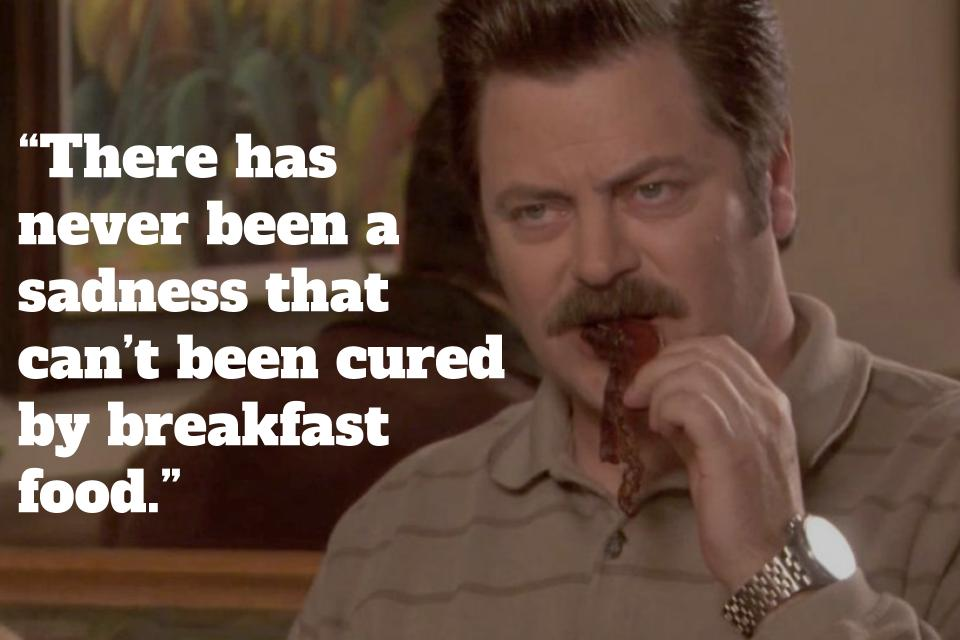

# Ron Swanson Quotes Homework

## By Andreina & Galit

[Click Here](https://gal333t.github.io/ronswanson/)

Was this just homework that we took a bit too far? Perhaps, but look how fun the website is! It would have been rude not to publish it, allowing anyone to find that Ron Swanson quote they've been missing in their life.

Our homework was to pick an API of our choosing and make at least 3 requests to a JSON API using axios. Shout out to Andreina for taking it above and beyond with the CSS, absolutely nailed it. If only this was marked, a 3/3 if you ask me.

We also used 2 different APIs, one to display a little bit of info (name, character, image) and another that generates the quotes. You can search by a specific word, number or randomly generate a quote.

Ron Swanson is an iconic character from the NBC show Parks and Recreation. Hilariously known for his love of breakfast foods and woodworking. His deadpan humor and dry wit contribute to his charm and make him a beloved character in the series.

